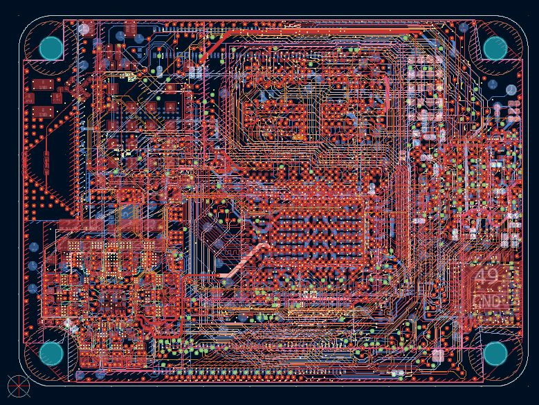

# Reverse Engineered Raspberry Pi Compute Module 5

This is the reverse engineered schematic and layout for a Raspberry Pi
Compute Module 5. It's not meant to be fabricated--critical signal integrity
parameters aren't correct, it's not 100% faithful to the original, the
footprints aren't a perfect match, and the bill of materials is not
reverse engineered. You also won't be able to obtain most of the chips
since they are custom for this design or only available to large customers,
not through a distributor.

I'm sure folks will want the schematic of the regular Pi 5, but I don't
have plans to reverse engineer that.

[Schematic PDF](CM5RevEng.pdf)

[Bonus schematic of the RM0 WiFi/Bluetooth module](rpi-rm0/rpi-rm0.pdf)

## Why?

I needed to solve some design issues with a project that uses one of these
modules, but the schematic was not available. Fortunately, with a little
reverse engineering work, I was able to back out the schematic and solve my
design issues.

It's useful mainly for educational purposes or advanced hacking. For example,
now that the PMIC pinout is known, the I2C register map could be explored.
It's a great little part--if you accidentally blow up a CM5, you might be able
to remove everything except for the PMIC, program it over I2C, and use it
to power another project.

## How?

I removed all the parts from the board, measured them with an LCR meter (and
VNA, in the case of the ferrite beads), and then sanded down the board one
layer at a time, imaging each with a flatbed scanner at 9600 DPI. KiCad layout
lets you embed images which is great for tracing.

## Fun Trivia

The resistors in the upper right corner that select the memory and eMMC
configuration are not zero-ohm devices. Each possible position has a specific
resistor value, forming a resistor divider with a 10K resistor, so that
the RP1 can measure the voltage with two ADC inputs and determine the
configuration.

The board has 10 layers. It is what's known as a 2+6+2 configuration since
it has four layers of microvias: layer 1-2, 2-3, 8-9, and 9-10. There are
buried mechanical vias from layers 2-9, and standard through-board vias
from layers 1-10.

The PMIC has a hot-swap function to limit the inrush current to the
\>350uF of capacitance on the 5V rail. External capacitance on the carrier
board is probably unnecessary.

The WiFi and Bluetooth functions can be disabled (through GPIO) from the
BCM2712 as well as the connector pins. You can detect this externally
by monitoring the voltages on the BT\_nDISABLE and WL\_nDISABLE pins.

The CM5 with onboard eMMC will not conflict with an external SD card (wired
to the pins on the connector). This is because the SD pins are unconnected on
this version of the module.

The original board has no designators, so the ones in this design are
made up, with the exception of the test points, which are documented
in the official RPi datasheet.

The 5V input goes through a hot-swap circuit with a series pass MOSFET. Since
there is a test point on either side of the MOSFET and the part number is
known (DMG7430LFG), you could monitor the voltage across and compute the
supply current based on the MOSFET RDSON.

## Board Stackup

By very carefully sanding through the board one layer at a time, I figured
out the approximate stackup using digital calipers.

| Layer | | Approximate Thickness (mm) | Function |
|-------|-|----------------------------|----------|
| 1     | Cu | 0.0522 | Top layer |
|       | PP | 0.0450 | |
| 2     | Cu | 0.0522 | Ground, PMIC LX, some signals. Reference layer for 1 and 3. |
|       | PP | 0.0600 | |
| 3     | Cu | 0.0348 | Signal and power. |
|       | PP | 0.1400 | |
| 4     | Cu | 0.0348 | Ground. |
|       | Core | 0.0600 | |
| 5     | Cu | 0.0522 | Power, limited signal. |
|       | PP | 0.1176 | |
| 6     | Cu | 0.0522 | Power. |
|       | Core | 0.0600 | |
| 7     | Cu | 0.0348 | Ground. |
|       | PP | 0.1400 | |
| 8     | Cu | 0.0348 | Signal and power. |
|       | PP | 0.0348 | |
| 9     | Cu | 0.0522 | Ground. Reference layer for 8 and 10. |
|       | PP | 0.0450 | |
| 10    | Cu | 0.0522 | Bottom layer | 

## Updated Test Point List

The Raspberry Pi Compute Module 5 datasheet has a table of test points, but
most of them are listed as "reserved." Here's a complete table. The coordinates
are relative to the lower left corner of the board (if the board had
a rectangular corner instead of being rounded off), increasing to the right
and upwards. Note that, in the KiCad layout, the lower left corner
is at 100mm x 100mm, and the Y axis is flipped, decreasing as you move
up. To change a coordinate from this table to KiCad, add 100 to the X
coordinate, and subtract the Y coordinate from 100.

| Reference | X     | Y     | NAME          | DESCRIPTION |
|-----------|-------|-------|---------------|-------------|
| MH4       | 51.5  | 36.5  | Mounting Hole | |
| MH3       |  3.5  | 36.5  | Mounting Hole | |
| MH2       | 51.5  |  3.5  | Mounting Hole | |
| MH1       |  3.5  |  3.5  | Mounting Hole | |
| TP1       | 14.34 | 17.54 | +5V | Raw 5V power to board. |
| TP2       |  8.8  |  1.3  | RUN | Unknown PMIC status output, possibly power good. |
| TP3       | 51.2  | 32.6  | GND |
| TP4       |  4.8  | 13    | PMIC INT | PMIC interrupt output (likely). |
| TP7       | 24.2  |  7.5  | GND |
| TP8       |  1.65 | 15.05 | GND |
| TP9       |  1.5  | 10.05 | VREF\_3V3 | Analog 3.3V to RP1 for ADCs. |
| TP10      | 48.4  | 15.1  | VREG | Unknown regulated voltage to RP1. |
| TP13      | 42.6  |  7.3  | GND |
| TP15      | 14.7  |  6.6  | VDD\_0V8\_LDO | 0.8V LDO regulator to BCM2712. |
| TP16      |  9.3  | 34.9  | nRPIBOOT | Hold low for boot mode. |
| TP17      | 37.4  |  8.1  | VDD\_3V3\_2 | Secondary 3.3V rail for NOR flash and eMMC. |
| TP21      | 24.5125 | 14.025 | nRESET\_OUT | BCM2712 reset output (status). |
| TP22      | 13.0875 | 11.225 | PMIC\_SIG | Unknown PMIC signal. Could be for PMIC OTP programming. |
| TP26      | 17.7  | 20.2  | GND |
| TP27      | 43.6  | 22.3  | VDD\_1V1\_RP1 | RP1 1.1V core voltage supply. |
| TP28      | 15.4  | 16    | VDD\_BCM\_CORE | BCM2712 core voltage rail. Nominally 0.8V. |
| TP29      | 23.65 | 21.55 | VDD\_0V8\_BCM | BCM2712 auxiliary 0.8V rail. |
| TP30      | 37.2  | 34.9  | VDD\_0V6 | LPDDR4 VDDQ supply. |
| TP31      |  9.1  |  3.2  | VDD\_1V1 | LPDDR4 VDD2 supply. |
| TP32      |  1.5  | 13    | VDD\_3V7\_WIFI | 3.7V rail for WiFi radio. |
| TP33      | 47    | 36    | CM5\_3V3 | Main 3.3V supply rail. |
| TP34      | 50.5  | 15.5  | CM5\_1V8 | Main 1.8V supply rail. |
| TP35      | 11    | 37.8  | DEBUG\_UART\_TX | Debugging UART transmit output. |
| TP36      |  8.5  | 37.1  | DEBUG\_UART\_RX | Debugging UART receive input. |
| TP39      | 22.1  |  6.1  | EN\_LOAD\_SWITCH | Enables VDD\_3V3\_2 and VDD\_1V8\_2 when asserted. |
| TP40      |  6.7  | 15.2  | PMIC\_SCL | PMIC I2C bus clock. |
| TP41      |  8.7  | 15.3  | PMIC\_SDA | PMIC I2C bus data. |
| TP42      | 11.4  | 34.9  | PWR\_BUT | Power button signal to PMIC. |
| TP44      | 51.7  | 30.2  | VDD\_2V5\_RP1 | RP1 internal voltage regulator: 2.5V supply. |
| TP45      | 53.1  | 28.7  | VDD\_1V1\_RP1 | RP1 internal voltage regulator: 1.1V supply. |
| TP46      |  7    | 34.7  | GND |
| TP48      | 21.6  | 15.4  | SOC\_TRST\_N | BCM2712 JTAG test reset input. |
| TP49      | 21.6  | 13.3  | SOC\_TDI | BCM2712 JTAG test data input. |
| TP50      | 20.4  | 17.2  | SOC\_TDO | BCM2712 JTAG test data output. |
| TP51      | 20.3  |  8.8  | SOC\_TMS | BCM2712 JTAG test mode select. |
| TP52      | 19.9  | 11.9  | SOC\_TCK | BCM2712 JTAG test clock. |
| TP57      | 53.2  | 32    | RP1\_TP | Unknown RP1 signal. |
| TP60      | 48    | 38.7  | GND |
| TP61      | 6.575 | 1.225 | GND |
| TP62      | 22.2  | 31.6  | GND |
| TP63      |  8.7  | 18.2  | 5V\_SENSE | Main board 5V rail, after hot-swap/inrush limiting MOSFET. |
| TP64      | 47.3  |  5.4  | VDD\_1V0\_PHY | BCM54210 internal voltage regulator: 1.0V supply. |
| TP65      | 28.2  |  7.5  | USBC\_D\_N | BCM2712 USB 2.0. |
| TP66      | 26.1  |  7.5  | USBC\_D\_P | BCM2712 USB 2.0. |
| TP67      |  7    | 38.6  | LED\_nPWR | Power LED, driven by RP1. |
| TP68      | 13    | 37.5  | LED\_nACT | Activity LED, driven by BCM2712. |
| TP69      | 38.8  | 25.9  | ETH0\_P |
| TP70      | 39.6  | 24.2  | ETH0\_N |
| TP71      | 43.8  | 14.1  | ETH1\_N |
| TP72      | 45.6  | 13.1  | ETH1\_P |
| TP73      | 42.4  | 31.7  | ETH2\_P |
| TP74      | 42.6  | 33.7  | ETH2\_N |
| TP75      | 41.6  | 37.8  | ETH3\_P |
| TP76      | 42.9  | 36.1  | ETH3\_N |
| TP77      | 14.37 | 19.52 | +5V     | Raw 5V power to board. |

## RP1 Pinout Mysteries

There are some pins that have not been identified because they're not connected
on the CM5:

| Pin | Guess |
|-----|-------|
| A2  | |
| B3  | |
| C2  | |
| C3  | |
| C4  | |
| D1  | |
| E3  | |
| E10  | |
| E15  | |
| F1  | |
| F2  | |
| F3  | |
| F7  | |
| G1  | |
| G2  | |
| H1  | |
| H3  | |
| H7  | |
| H17 | USB 2.0? |
| H18 | USB 2.0? |
| J15  | |
| J17  | |
| L13  | |
| L15  | |
| M17  |USB 2.0? |
| M18  |USB 2.0? |
| R4  | |
| T3  | |
| T4  | |
| T13  | |
| T14  | |
| V2  | |
| V3  | |

## Future Work

* PCIe (BCM2712 to RP1) net identification
* RP1 to BCM2712 net identification
* PMIC I2C register map

## License

[CC BY-SA 4.0](https://creativecommons.org/licenses/by-sa/4.0)

